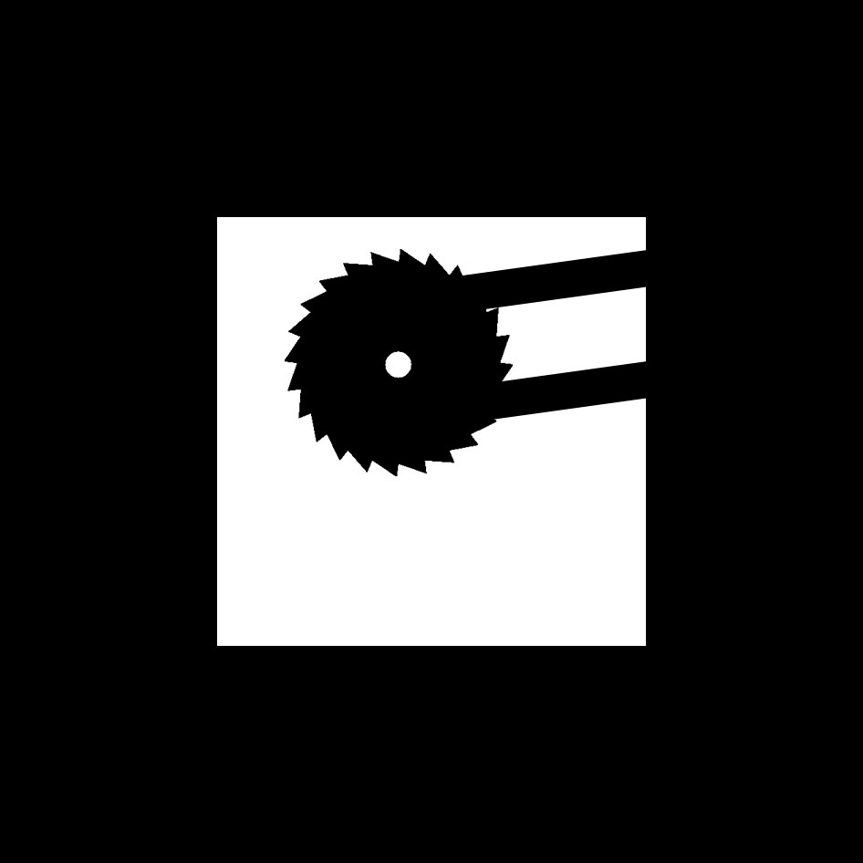
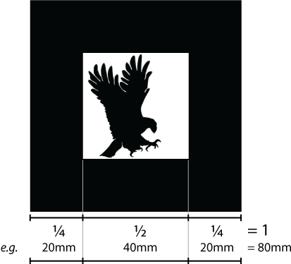
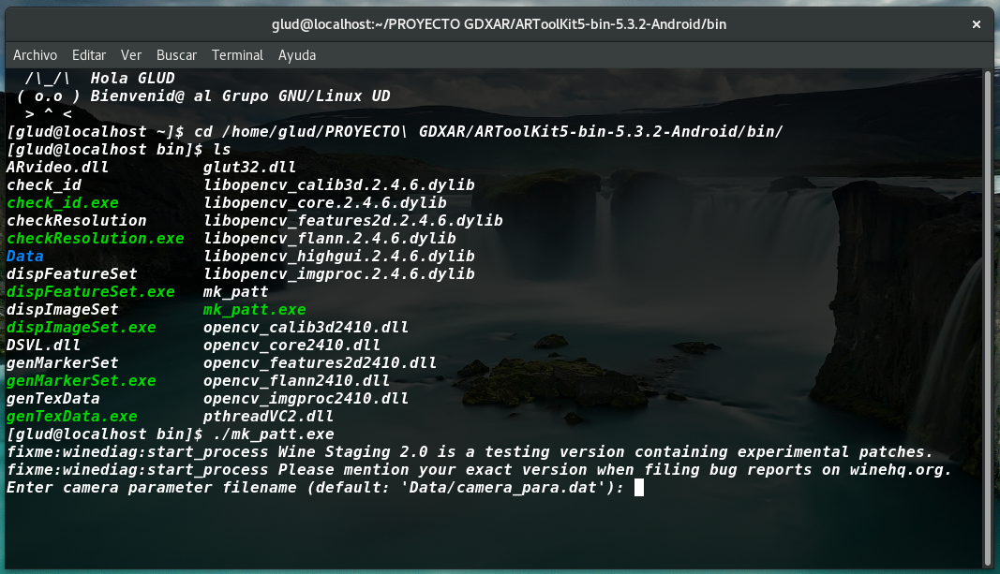

## ¿Que son los marcadores?
Son imágenes que contienen un patrón cuadrangular que ARToolKit reconoce durante la captura de video por medio de la cámara del dispositivo.

Los marcadores deben ser construidos bajo ciertos parámetros:
* Deben ser cuadrados
- Deben tener un borde continuo (por lo general de un solo color, blanco o negro) y deben contrastar con el fondo, cuyo color generalmente es opuesto al del marcador
+ La imagen que se encuentra adentro del marcador, o imagen central debe ser rotacionalmente asimétrica, es decir que no debe ser simétrica al rotarse en cualquier ángulo respecto a su centro
* La imagen central puede estar dibujada en blanco y negro o puede contener color en su diseño

Para versiones de ARToolKit v4.x se puede hacer uso de marcadores que contienen una malla de cuadros blancos y negros similares a los códigos QR en lugar de la típica imagen central que poseen los marcadores. Estos patrones son útiles para reducir el tiempo de carga cuando la cantidad implementada en la aplicación es considerable.

## Creando nuevos marcadores
Las medidas que por defecto maneja ARToolKit para los marcadores son las siguientes y son importantes para que la aplicación reconozca los patrones sin problemas.

## Usando la herramienta mk_patt
El uso de esta utilidad es bastante sencillo. Para comenzar, desde una terminal de comandos (ya sea en Windows, Mac OS o Linux) dirigirse hasta el directorio donde se encuentra ARToolKit y en la carpeta bin ejecutar el binario mk_patt. A continuación se ejemplifica el proceso mediante una imagen:

Al arrancar, la aplicación solicita el archivo con los parámetros de la cámara que se va a usar para programar los marcadores. Para usar los parámetros por defecto simplemente se debe presionar Enter.
Posteriormente debe aparecer la captura en tiempo real de la cámara que se esta usando.

El siguiente paso se trata de apuntar la cámara directamente al marcador tratando de que este ocupe toda el área de la pantalla. Al hacer esto, el borde de la imagen será resaltado con una línea de color rojo y verde.

Se debe rotar y acomodar el marcador con respecto a la cámara, hasta que la esquina superior izquierda de este, se vea resaltado por una línea roja, y la esquina inferior derecha por una línea verde. Al estar acomodado solo falta presionar el botón izquierdo del ratón (dar click) para que se genere una captura de la imagen.

En la terminal se debe introducir el nombre que se le quiera dar al patrón con la condición de que debe tener la extensión .patt (para la mayoría de los casos), por ejemplo mipatron.patt o primerpatron.patt, y presionar Enter al terminar. 

Después de esto, la aplicación permite seguir creando patrones o se puede cerrar presionando el botón derecho del ratón  botón secundario).
