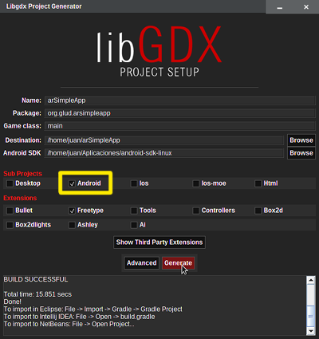
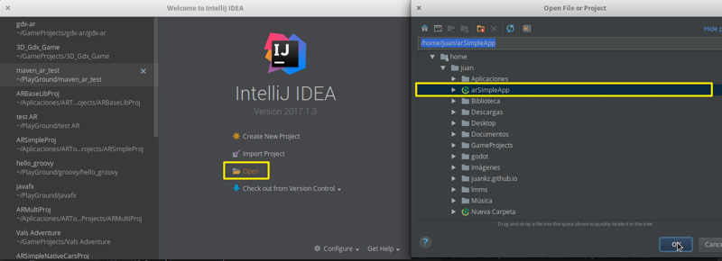
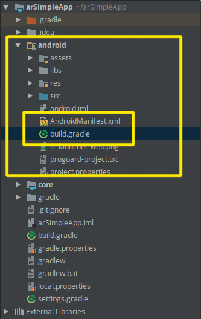
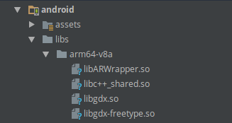
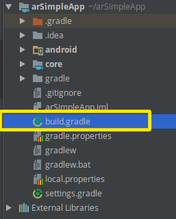

At the end of this tutorial you will have a project set to start programming an AR application

## Requisitos
If you have used libGDX before, probably you have most of this stuff installed, you only need to download the ARToolKit native libraries. If you have never worked with libGDX, it is necessaty to have intalled install in your machine:

* JDK 7 o greater
* ADB
* Android SDK with:
	* Mínimum SDK installed must be SDK Platform 4.4
	* Android SDK Tools
	* Android SDK Tools Platform
	* Android Build Tools
* IntelliJ IDEA or Android Studio, each one has advantages over the other. For this tutorial IntelliJ IDEA will be used.
* libGDX setup app, can get it from [the official website](http://libgdx.badlogicgames.com/download.html)
* Configuration files, where are located the ARToolKit Native Libraries and the camera configuration file. Download it [here](/downloads/config_files.zip) <a href="/downloads/config_files.zip" class="icon fa-download"></a>

## Start libGDX setup application
And enter the correpondent data, including Android SDK path, check the image as a guide. Note that only the android box is checked. I included freetypefont extension because I would like to add a cool tipography to my project, although it is not necessary. More information about this step [here](https://github.com/libgdx/libgdx/wiki/Project-Setup-Gradle)


<center>

</center>

## Open on IDE
Mi project was created under the directory arSimpleApp on mi user folder, the next step is open it on our favorite IDE. My favorite one is IntelliJ IDEA

<center>

</center>


## MODIFY FILES: ANDROID MANISFEST AND GRADLE

Cool! Now that we have our project open, the first thing to do is modify the minimum sdk version if it is not 15. This is done in the files AndroidManifest.xml and build.gradle located inside the android module.

<span class="image left"></span>

In AndroidManifest.xml

```xml
<!--Add camera permission-->
<uses-permission android:name="android.permission.CAMERA" />
    <uses-feature android:name="android.hardware.camera.any" />
    <uses-feature
        android:name="android.hardware.camera"
        android:required="false" />
    <uses-feature
        android:name="android.hardware.camera.autofocus"
        android:required="false" />

<!--Modify minimum versión of android sdk-->
<uses-sdk android:minSdkVersion="15" android:targetSdkVersion="25" />

...

<!-- Add camera preferences Activity, don't touch anything else -->
<application ... >
        <activity
            ...
        ></activity>
        <activity android:name="org.artoolkit.ar.base.camera.CameraPreferencesActivity"
                  android:label="Camera Prefs"
                  android:screenOrientation="landscape"
                  android:configChanges="keyboard|keyboardHidden|orientation|screenSize">
        </activity>
    </application>
```

In build.gradle

```groovy
defaultConfig {
    ...
    minSdkVersion 15
    ...
}
```

## Add ARToolKit native libraries

<span class="image right"></span>

Simply extract the downloaded configuration files. Look inside the forlder _Native Libs_ and you will see the ARToolKit libraries. Move the folders inside the directory _android/libs_. The end result should be similar to the image, with the files  *libARWrapper.so* and *libc++_shared.so* inside each architecture: **arm64-v8a**, **armeabi**, **armeabi-v7a**, **x86** and **x86_64**

## Add _Data_ folder to assets
The _Data_ folder is very important, you will find it iside the _config_files_ folder too, here is located the camera configuration file:_camera_para.dat_. Also is the place where we will add all markers files (extension _.patt_). Just copy it to the assets folder inside android module.

## Add trascendentAR to the project

To do this, we have to edit the file build.gradle located in the root of the project (check image).

<span class="image right"></span>

1. Inside the file, search for ```project(":android")``` and add under dependencies the line ```compile 'org.glud.trascendentAR:trascendentAR-android:1.0-beta.1'```

2. same way, search for ```project(":core")``` and add under dependencies the line ```compile 'org.glud.trascendentAR:trascendentAR-core:1.0-beta.1'```

End result would be something like:

```
project(":android") {
    apply plugin: "android"

    configurations { natives }

    dependencies {
        compile project(":core")
        compile 'org.glud.trascendentAR:trascendentAR-android:1.0-beta.1'
        compile "com.badlogicgames.gdx:gdx-backend-android:$gdxVersion"
        .
        .
        .
    }
}
project(":core") {
    apply plugin: "java"

    dependencies {
        compile 'org.glud.trascendentAR:trascendentAR-core:1.0-beta.1'
        compile "com.badlogicgames.gdx:gdx:$gdxVersion"
        compile "com.badlogicgames.gdx:gdx-freetype:$gdxVersion"
    }
}
```
Synchronize gradle. A fail proof method is to close and reopen the project in the IDE. Probably you may see a dialog asking to _Import changes in gradle_. Press import
