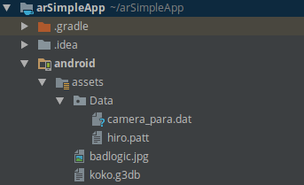
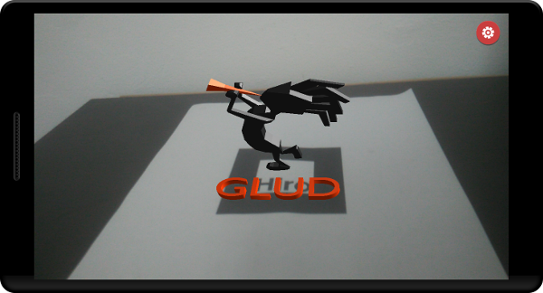

If you have reached here, it means you already [configured a proyect](setting_up_project.html) and are ready to create your first augmented reality application. Remember that source code for this tutorial can be found on [github](https://github.com/Juankz/arSimpleApp). If ypu have any doubt regarding a file or project organization, go to the source and check it out.

## Getting ready with assets
For any augmented reality application we need two things. First one is a marker which is a file describing a pattern or image that our application is going to track. Second one is a 3D model to show once our marker is visible. Download both of them [here](/downloads/simpleapp_assets.zip) <a href="/downloads/simpleapp_assets.zip" class="icon fa-download"></a>

Aditionally on the downloaded folder you will find 2 images _cam_button_down.png_ and _cam_button_up.png_ those will be used to create a button connecting to camera settings for adjust of resolution and what type of camera will be used (front or rear)

Copy your assets to the _assets_ folder, but the file hiro.patt must go **inside the Data folder** as it is going to be used by the AR module.

## Adding Code on android side
Trascendentar includes all methods to initialize an android application from android side, including camera, graphics layer and of course implementing a proper way to manage these resources when the app closes, pauses and resumes. So you don't have to worry about anything.

To access all this benefits of trascendentAR library, the class _AndroidLauncher.java_ inside android module, must extend ARLauncher using `public class AndroidLauncher extends ARLauncher` (duh!)

Then implement the absent methods to load markers and the end result should be:

``` java

public class AndroidLauncher extends ARLauncher {
	@Override
	protected void onCreate (Bundle savedInstanceState) {
		super.onCreate(savedInstanceState);
		AndroidApplicationConfiguration config = new AndroidApplicationConfiguration();
		initialize(new main(), config);
	}

	@Override
	public void configureARScene() {
	}
}
```

Now change the line `initialize(new main(), config);` for `initialize(new main(this), config);` so we can access ARToolKit methods from the core module

## Load markers

<span class="image left"></span>

Cool, now lets load a marker using the method _loadMarker(String name,String marker_type, String path_to_marker,int size)_. Like this:

``` java
@Override
	public void configureARScene() {
		loadMarker("hiroMarker",MarkerType.SINGLE,"Data/hiro.patt",8);
	}
```
* Marker types are basically two: Single or Multiple, more information about the diferences [here](https://archive.artoolkit.org/documentation/doku.php?id=3_Marker_Training:marker_multi). This property can be accesed using MarkerType.TYPE
* The marker patt must always point to the folder _Data_
* Recomended size is grater than 4 units and less than 100. Actually te maximum value is determined by the parameters given to the libGDX camera by you.

## Using ARToolKit Manager to access augemented reality methods

Inside the core module
``` java
package org.glud.arsimpleapp;

//imports ...

public class main extends ApplicationAdapter {
	ARToolKitManager arManager; //To access AR methods
	AssetManager assetManager; //To Load assets
	ModelInstance koko; //Instance of our 3D model
	ARCamera camera; //Augmented reality Camera
	ModelBatch batch_3d; //To render 3D objects on screen
	Environment environment; //Control lights
	Matrix4 transform = new Matrix4(); //Auxiliar matrix
	Stage stage; //2D stuff and input for 2D
	Button cameraPrefsButton;

	//Important! this is how we can connect with Android side and artoolkit methods
	public main(ARToolKitManager arManager){
		this.arManager = arManager;
	}

	@Override
	public void create () {
		Gdx.app.setLogLevel(Application.LOG_DEBUG);

		//Setting up libGDX camera
		camera = new ARCamera(67,Gdx.graphics.getWidth(),Gdx.graphics.getHeight());
		camera.position.set(0f,0f,1f);
		camera.lookAt(0,0,0);
		camera.near = 0;
		camera.far = 1000f;
		camera.update();

		//Load assets
		assetManager = new AssetManager();
		assetManager.load("koko.g3db", Model.class);
		assetManager.load("cam_button_down.png", Texture.class);
		assetManager.load("cam_button_up.png", Texture.class);
		assetManager.finishLoading();//Wait until load everything

		// Create a model instance
		koko = new ModelInstance(assetManager.get("koko.g3db",Model.class));

		//Adding lights
		environment = new Environment();
		environment.set(new ColorAttribute(ColorAttribute.AmbientLight, 0.4f, 0.4f, 0.4f, 1f));
		environment.add(new DirectionalLight().set(0.8f, 0.8f, 0.8f, -1f, -0.8f, -0.2f));

		batch_3d = new ModelBatch();

		stage = new Stage(new ScreenViewport());
		/* Create a button to open the camera preferences activity. First we define what images will be rendered when up and down. Usually this is made with a skin, but for this example we will do it using code
		 */
		Button.ButtonStyle buttonStyle = new Button.ButtonStyle();
		buttonStyle.up = new Image(assetManager.get("cam_button_up.png",Texture.class)).getDrawable();
		buttonStyle.down = new Image(assetManager.get("cam_button_down.png",Texture.class)).getDrawable();
		cameraPrefsButton = new Button(buttonStyle);
		//Damos una posicion en la parte superior derecha de la pantalla
		cameraPrefsButton.setPosition(stage.getWidth() - 20 - cameraPrefsButton.getHeight(),stage.getHeight() - 20 - cameraPrefsButton.getHeight());

		// Recognize when button is clicked and open camera preferences using arToolKitManger
		cameraPrefsButton.addListener(new ClickListener(){
			public void clicked (InputEvent event, float x, float y) {
				arManager.openCameraPreferences();
			}
		});

		/* Let's add the button to the stage		 */
		stage.addActor(cameraPrefsButton);

		/* Finally as we have a button to be pressed, we need to make stage to receive inputs*/
		Gdx.input.setInputProcessor(stage);
	}

	@Override
	public void render () {
		/* (1)
		* Clean screen of black color with alpha zero. Keep in mind that the gl flags used are not the ones that come by default in libGDX
		*/
		gl.glClearColor(0, 0, 0, 0);
		gl.glClear(GL20.GL_COLOR_BUFFER_BIT | GL20.GL_DEPTH_BUFFER_BIT);

		/* (2)
		* Before call any AR method we must be sure the augmented reality module is
		* ready and running.
		*/
		if(!arManager.arRunning())return;

		/*(3)
		 *	Update camera projection matrix using device camera projection matrix
		 * provided by artoolkit
		 */
		camera.projection.set(arManager.getProjectionMatrix());

		/*(4)
		*	Check if marker is visible, markerID string should be equal to the marker name given on AndroidLauncher when marker was loaded
		*/
		String markerID = "hiroMarker";
		if(arManager.markerVisible(markerID)){
			transform.set(arManager.getTransformMatrix(markerID));
			/* (5)
			 * Update camera
			 */
			transform.getTranslation(camera.position);
			camera.position.scl(-1);
			camera.update();

			/* (6)
			 * Depending from model coordinates it may be desired to apply a rotation
			 */
			transform.rotate(1, 0, 0, 90);
			koko.transform.set(transform);

			/* (7)
			 * Draw objects on screen
			 */
			batch_3d.begin(camera);
			batch_3d.render(koko, environment);
			batch_3d.end();
		}
	}

	/* Proper memory management	*/
	@Override
	public void dispose () {
		stage.dispose();
		batch_3d.dispose();
		assetManager.dispose();
	}
}
```

**Extended explanation:** If ypu are not familiar with libGDX 3D API, I suggest you to check [Xoppa tutorials](https://xoppa.github.io/blog/basic-3d-using-libgdx/) to get how it works. Some other thing you have to keep in mind:
* The camera used is ARCamera, a variation of perspective camera.
* Main class or _main_ as I called it, accepts a parameter ARToolKitManager in the constructor, this one is sent by AndroidLauncher.
* Always check if armodule is running with `arManager.arRunning()`
* G3DB is a 3D models format used by libGDX, it is posible to convert from other formats like FBX o OBJ a G3DB using [this libGDX tool](https://github.com/libgdx/fbx-conv). But beware of some limitationsm more information [here](https://github.com/libgdx/libgdx/wiki/Importing-Blender-models-in-LibGDX).

## Run the app

1. Generate APK usder IntelliJ IDEA tab Build
2. Install on the device: Unfortunately this step must be done though terminal, fortunately IntelliJ IDEA and Android Studio provide a useful console to use. Simply write the following line: `adb install -r android/build/outputs/apk/android-debug.apk` and the app will be instaled on your device

NOTA: You could shorten this steps in just one code line:

`./gradlew assemble && adb install -r android/build/outputs/apk/android-debug.apk`

## Enjoy
Point the camera to the pattern and watch the magic
<center>

</center>
