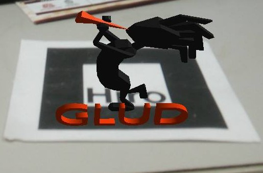

If you have reached here, it means you already [configured a proyect](setting_up_project.html) and are ready to create your first augmented reality application.

## Adding Code
Trascendentar includes all methods to initialize an android application from android side, including camera, graphics layer and of course implementing a proper way to manage these resources when the app closes, pauses and resumes. So you don't have to worry about anything.

To access all this benefits of trascendentAR library, the class _AndroidLauncher.java_ inside android module, must extend ARLauncher using `public class AndroidLauncher extends ARLauncher` (duh!)

Then implement the absent methods to load markers and the end result should be:

``` java

package org.glud.arsimpleapp;

import android.os.Bundle;

import com.badlogic.gdx.backends.android.AndroidApplication;
import com.badlogic.gdx.backends.android.AndroidApplicationConfiguration;
import org.glud.arsimpleapp.main;
import org.glud.trascendentar_android.ARLauncher;

public class AndroidLauncher extends ARLauncher {
	@Override
	protected void onCreate (Bundle savedInstanceState) {
		super.onCreate(savedInstanceState);
		AndroidApplicationConfiguration config = new AndroidApplicationConfiguration();
		initialize(new main(), config);
	}

	@Override
	public boolean configureARScene() {
		return true;
	}
}
```
Asegúrate de que el método `configureARScene()` retorne **true** o el programa no cargará ningún marcador.

## Cargar marcadores

<span class="image left"></span>

1. Crear carpeta _Data_ con marcadores dentro del directorio de  _assets_ en el módulo android. El nombre de la carpeta no debe cambiar o trascendentAR no será capaz de localizar los marcadores.
2. Copiar el archivo hiro.patr a la carpeta _Data_ recién creada
3. Dentro del método `configureARScene` carga el marcador usando el método loadMarker:  `loadMarker(MarkerType.SINGLE,"Data/hiro.patt",8);`
4. Agregar archivo _camera_para.dat_ en la carpeta _Data_


Resultado:

``` java
@Override
public boolean configureARScene() {
    loadMarker("hiroMarker",MarkerType.SINGLE,"Data/hiro.patt",8);
    return true;
}
```
Este método añade un marcador para ser reconocido por ARToolKit, los parámetros de entrada son los siguientes: nombre del marcador, tipo de marcador, ruta del marcador (siempre debe estar en la carpeta _Data_) y tamáño del marcador, recomendado mayor a 4 unidades y menor a 100. EL tope máximo realmente depende de la distancia focal que se asigne a la cámara.

## Usar ARToolKit Manager para acceder métodos de realidad aumentada

Desde el módulo core, se maneja toda la lógica del juego o aplicación. El siguiente código está bien comentado y es suficientemente auto-explicativo:

``` java
package org.glud.arsimpleapp;

import com.badlogic.gdx.ApplicationAdapter;
import com.badlogic.gdx.Gdx;
import com.badlogic.gdx.assets.AssetManager;
import com.badlogic.gdx.graphics.GL20;
import com.badlogic.gdx.graphics.Texture;
import com.badlogic.gdx.graphics.g2d.SpriteBatch;
import com.badlogic.gdx.graphics.g3d.Environment;
import com.badlogic.gdx.graphics.g3d.Model;
import com.badlogic.gdx.graphics.g3d.ModelBatch;
import com.badlogic.gdx.graphics.g3d.ModelInstance;
import com.badlogic.gdx.math.Matrix4;
import org.glud.trascendentAR.ARCamera;
import org.glud.trascendentAR.ARToolKitManager;

public class main extends ApplicationAdapter {
	ARToolKitManager arManager; //Accede a los métodos de realidad aumentada
	AssetManager assetManager; //Se usa para cargar recursos
	ModelInstance koko; //La instancia del modelo que se va a usar
	ARCamera camera; //Cámara de realidad aumentada
	ModelBatch batch_3d; //Este objeto se encarga de pintar todos las instancias 3D en pantalla
	Environment environment; //Controla la iluminación del espacio
	Matrix4 transform = new Matrix4(); //Matriz auxiliar para manipular modelos si es necesesario

	@Override
	public void create (ARToolKitManager arManager) {
		this.arManager = arManager;

		//Configurar cámara de libGDX
		camera = new ARCamera(67,Gdx.graphics.getWidth(),Gdx.graphics.getHeight());
		camera.position.set(0f,0f,1f);
		camera.lookAt(0,0,0);
		camera.near = 0;
		camera.far = 1000f;
		camera.update();

		/*
		 * Agregar luces al espacio 3D
		 * Add lights to 3D space
		 */
		environment = new Environment();
		environment.set(new ColorAttribute(ColorAttribute.AmbientLight, 0.4f, 0.4f, 0.4f, 1f));
    environment.add(new DirectionalLight().set(0.8f, 0.8f, 0.8f, -1f, -0.8f, -0.2f));

		/*
		 * Cargar recursos -> Modelo 3D
		 * Load assets -> 3D Model
		 */
		assetManager = new AssetManager();
		assetManager.load("koko.g3db", Model.class);
		assetManager.finishLoading();

		/*
		 * Crear una instancia del modelo
		 * create an instance from the model
		 */
		koko = new ModelInstance(assetManager.get("koko.g3db",Model.class));
	}

	@Override
	public void render () {
		/* (1)
		* Limpiar la pantalla con un color negro y alpha cero, esto es prácticamente un color transparente,
		* sin embargo de no ser un color negro, no funcionará adecuadamente
		*/
		gl.glClearColor(0, 0, 0, 0);
		gl.glClear(GL20.GL_COLOR_BUFFER_BIT | GL20.GL_DEPTH_BUFFER_BIT);

		/* (2)
		* Antes de llamar cualquier método de ARToolkit,debemos revisar
		* si el módulo de realidad aumentada ya está listo, de lo contrario
		* la aplicación fallará
		*/
		if(!arManager.arRunning())return;

		/*(3)
		*	Actualizar la matriz de proyección de la cámara
		*/
		camera.projection.set(arManager.getProjectionMatrix());

		/*(4)
		*	Comprobar si el marcador está visible, el texto asignado a markerID debe coincidir con
		* el nombre dado al marcador cuando se cargó en la clase AndroidLauncher
		*/
		String markerID = "hiroMarker";
		if(arManager.markerVisible(markerID)){
			transform.set(arManager.getTransformMatrix(markerID));
			/* (5)
			 * Actualizar Cámara
			 * Update camera
			 */
			transform.getTranslation(camera.position);
			camera.position.scl(-1);
			camera.update();

			/* (6)
			 * Dependiendo de las coordenadas del modelo puede necesitar rotarlo
			 * Depending from model coordinates it may be desired to apply a rotation
			 */
			transform.rotate(1, 0, 0, 90);
			koko.transform.set(transform);

			/* (7)
			 * Pintar objetos en pantalla
			 * Draw objects on screen
			 */
			batch_3d.begin(camera);
			batch_3d.render(koko, environment);
			batch_3d.end();
		}
	}

	/*
	* Manejo apropiado de memoria
	* Proper memory management
	*/
	@Override
	public void dispose () {
		batch_3d.dispose();
		assetManager.dispose();
	}
}
```

**Explicación extendida:** Si no estás familiarizado con 3D en libGDX, te recomiendo los tutoriales de [Xoppa](https://xoppa.github.io/blog/basic-3d-using-libgdx/) (En inglés). Algunas cosas que debes tener en cuenta son:
* La cámara que se usa es ARCamera, una cámara propia de trascendentAR.
* La clase principal o _main_ como se llamó en este caso, acepta un objeto ARToolKitManager en el constructor, este se envía desde AndroidLauncher.
* Siempre revisar si el módulo de realidad aumentada está funcionando usando `arManager.arRunning()`
* G3DB es el formato de modelos 3D que maneja libGDX, se puede convertir desde otros formatos como FBX o OBJ a G3DB usando [esta herramienta](https://github.com/libgdx/fbx-conv) de libGDX. Pero hay que tener en cuenta que tiene limitaciones, mayor información [aquí](https://github.com/libgdx/libgdx/wiki/Importing-Blender-models-in-LibGDX).

## Correr la aplicacion

1. Generar APK usando intelliJ IDEA en la pestaña Build
2. Instalar la aplicación en el teléfono móvil. Desafortunadamente este paso debe ser ejecutado por consola, afortunadamente IntelliJ IDEA y Android Studio nos proveen una consola que podemos usar. Simplemente hay que escribir la siguente línea: `adb install -r android/build/outputs/apk/android-debug.apk` y la aplicación se instalará en tu dipositivo

NOTA: También puedes resumir los 2 pasos anteriores en una sola línea de consola:

`./gradlew assemble && adb install -r android/build/outputs/apk/android-debug.apk`

## Disfruta
Point the camera to the pattern and watch the magic
<center>

</center>
